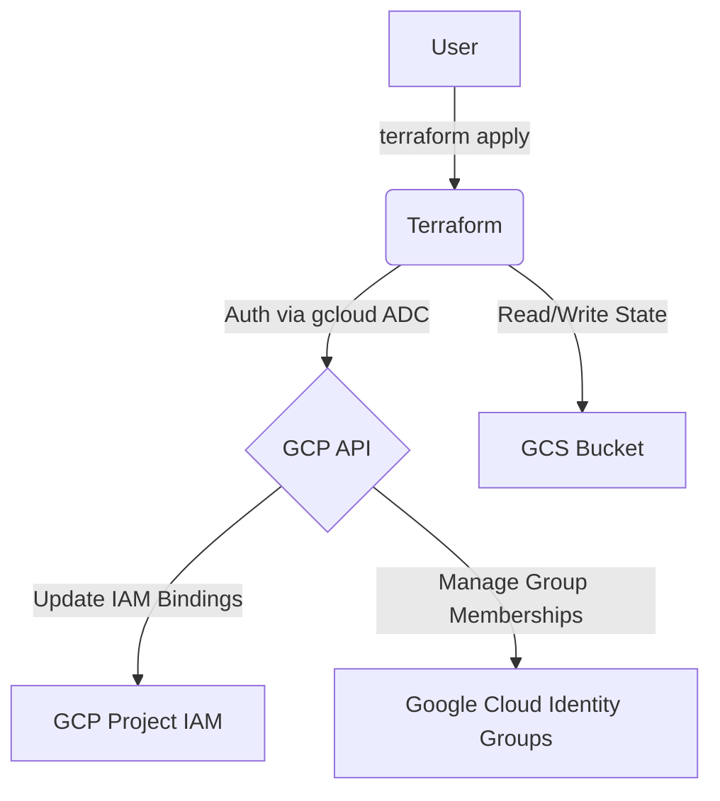
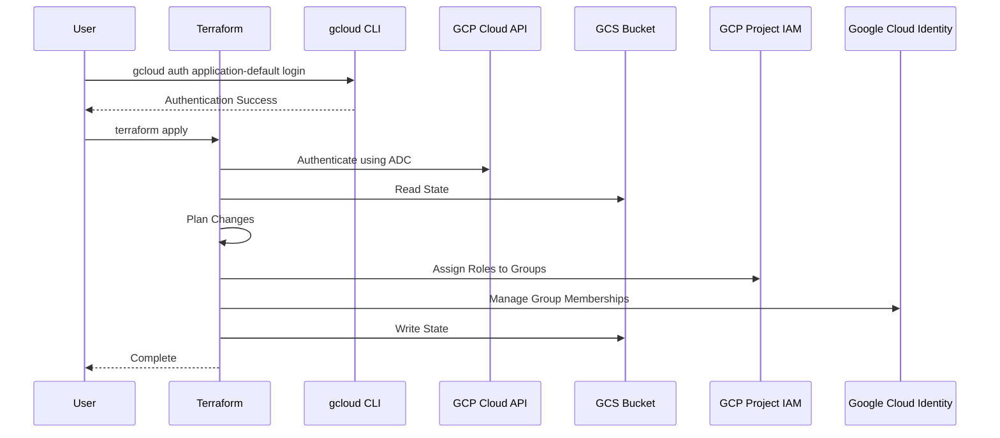

# terraform-gcp-iam-rbac-org

This Terraform project manages GCP IAM RBAC by assigning roles to Google Groups and managing group memberships. It uses GCS for remote state.

## Architecture



### Sequence Diagram


## Prerequisites

1. **Google Cloud SDK**: https://cloud.google.com/sdk/docs/install
2. **Terraform**: https://developer.hashicorp.com/terraform/downloads
3. **Google Cloud Organization & Google Groups**: This project assumes you already have an organization set up and the Google Groups (e.g., devops-team@yourdomain.com, dev-team@yourdomain.com) created. It manages IAM bindings and group memberships, but does not create the organization or groups themselves.

## Setup & Deployment

1. **Authenticate and Select Project**:
   This project uses your local `gcloud` credentials for authentication.

   ```bash
   # Authenticate
   gcloud auth application-default login

   # Select your project
   gcloud config set project your-project-id
   ```

2. **Configure Variables**:
   Create a `terraform.tfvars` file based on the example:

   ```hcl
   project_id       = "your-gcp-project-id"
   region            = "us-central1"
   backend_bucket   = "your-tfstate-bucket"
   backend_prefix    = "terraform-iam-rbac"

   team_permissions = {
     "devops-team@yourdomain.com" = [
       "roles/compute.admin",
       "roles/run.admin",
       "roles/cloudbuild.admin",
       "roles/storage.admin"
     ],
     "dev-team@yourdomain.com" = [
       "roles/compute.viewer",
       "roles/run.developer",
       "roles/cloudbuild.editor",
       "roles/storage.objectUser"
     ]
   }

   devops_group_name    = "devops-team@yourdomain.com"
   developer_group_name = "dev-team@yourdomain.com"

   devops_members = [
     "bob.ops@yourdomain.com",
     "charlie.ops@yourdomain.com"
   ]

   developer_members = [
     "alice.dev@yourdomain.com",
     "eve.dev@yourdomain.com"
   ]
   ```

3. **Create and Configure Backend Bucket (One-time)**:
   Create the GCS bucket for Terraform state and enable versioning (required for state locking):

   ```bash
   # Create the bucket (replace with your bucket name and region)
   gcloud storage buckets create gs://your-tfstate-bucket --location=us-central1

   # Enable versioning (required for state locking)
   gcloud storage buckets update gs://your-tfstate-bucket --versioning
   ```

4. **Initialize Backend (One-time)**:
   ```bash
   terraform init
   ```

5. **Validate Configuration**:

   ```bash
   terraform validate
   ```

6. **Plan Changes**:

   ```bash
   terraform plan
   ```

7.  **Apply Changes**:

    ```bash
    terraform apply
    ```

## Usage as a Module

Reference this repository as a Terraform module in your own configurations:

```hcl
module "iam_rbac_org" {
  source = "github.com/marcuwynu23/terraform-gcp-iam-rbac-org?ref=main"

  project_id = var.project_id
  region     = "us-central1"

  team_permissions = {
    "devops-team@yourdomain.com" = [
      "roles/compute.admin",
      "roles/run.admin",
      "roles/storage.admin"
    ],
    "dev-team@yourdomain.com" = [
      "roles/compute.viewer",
      "roles/run.developer"
    ]
  }

  devops_group_name    = "devops-team@yourdomain.com"
  developer_group_name = "dev-team@yourdomain.com"

  devops_members = [
    "bob@yourdomain.com",
    "charlie@yourdomain.com"
  ]

  developer_members = [
    "alice@yourdomain.com"
  ]
}
```

## Variables

| Variable | Description | Type | Default |
|----------|-------------|------|---------|
| `project_id` | GCP project ID | `string` | (required) |
| `region` | GCP region | `string` | `"us-central1"` |
| `backend_bucket` | GCS bucket for remote state | `string` | `"iammwwhobuild-tfstate-bucket"` |
| `backend_prefix` | Prefix in GCS bucket for state files | `string` | `"terraform-iam-rbac"` |
| `team_permissions` | Map of groups to their assigned GCP roles | `map(list(string))` | See defaults in `variables.tf` |
| `devops_members` | Users to add to the DevOps group | `list(string)` | See defaults in `variables.tf` |
| `developer_members` | Users to add to the Developer group | `list(string)` | See defaults in `variables.tf` |
| `devops_group_name` | DevOps Google Group name | `string` | `"devops-team@yourdomain.com"` |
| `developer_group_name` | Developer Google Group name | `string` | `"dev-team@yourdomain.com"` |

## Resources Created

- `google_project_iam_member.global_multi_team_access` – IAM role bindings for Google Groups
- `google_cloud_identity_group_membership.devops_users` – DevOps group memberships
- `google_cloud_identity_group_membership.developer_users` – Developer group memberships
## CI/CD Setup (GitHub Actions)

### Prerequisites
1. **Create a GCS bucket** for Terraform remote state:
    ```bash
    gcloud storage buckets create gs://your-terraform-state-bucket \
      --location=us-central1 \
      --uniform-bucket-level-access
    ```

2. **Create a service account** with necessary permissions and generate a JSON key:
    - GCP Console → IAM & Admin → Service Accounts → Create Service Account
    - Grant the required roles for this module
    - Keys → Add Key → Create New Key → JSON
    - Copy the entire JSON file contents

3. **Add GitHub secrets**:

    | Secret Name | Value |
    |---|---|
    | `GCP_SA_KEY` | Full JSON key from step 2 |
    | `TF_BUCKET_NAME` | Your GCS bucket name |
    | `TF_BUCKET_PREFIX` | Bucket prefix/path (e.g., `gcp-iam-rbac-org`) |

4. **Run the workflow**:
    - **Apply**: Go to Actions → **CD - GCP IAM RBAC Org (Apply)** → fill in all inputs
    - **Destroy**: Go to Actions → **CD - GCP IAM RBAC Org (Destroy)** → fill in essential inputs

> Alternatively, create a `backend.tfvars` from `backend.tfvars.example` and run `terraform init -backend-config="backend.tfvars"` for local use.

## Remote State (GCS Backend)

This module uses Google Cloud Storage (GCS) as the Terraform backend for remote state management:

```hcl
terraform {
  backend "gcs" {
    bucket = "your-terraform-state-bucket"
    prefix = "gcp-iam-rbac-org"
  }
}
```

Create a `backend.tfvars` file based on `backend.tfvars.example` and initialize:

```bash
terraform init -backend-config="backend.tfvars"
```

